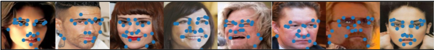
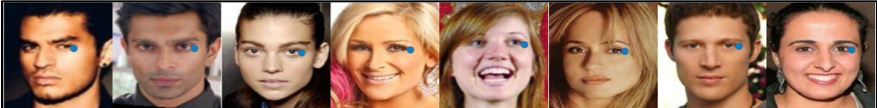
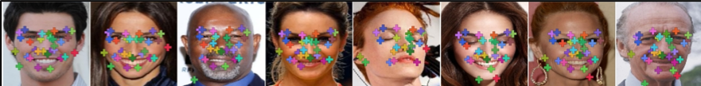

# Unsupervised Learning of Object Landmarks via Self-Training Correspondence (NeurIPS2020)
### Dimitrios Mallis, Enrique Sanchez, Matt Bell, Georgios Tzimiropoulos

This repository contatins the training and evaluation code for our NeurIPS 2020 paper ["Unsupervised Learning of Object Landmarks via Self-Training Correspondence"](https://papers.nips.cc/paper/2020/file/32508f53f24c46f685870a075eaaa29c-Paper.pdf). The sofware learns a deep landmark detector, directly from raw images of a specific object category, without requiring any manual annotations.


## Requirments

An overview or software requirments.

- Pytorch 1.4 or newer with torchvision
- [Faiss for GPU](https://github.com/facebookresearch/faiss) 
- [imgaug 0.4.0](https://github.com/aleju/imgaug) 
- [matrix_completion](https://pypi.org/project/matrix-completion/)
- [tables](https://pypi.org/project/tables/)
- [torchfile](https://pypi.org/project/torchfile/)
- Opencv (cv2)
- PyYAML
- cdflib
- h5py
- Scipy
- Sklearn
- matplotlib
- pandas
- Numpy

You will also require a reasonable CUDA capable GPU. This project was developed using Linux. 

## Data Preparation


### CelebA

CelebA can be downloaded [here](http://www.robots.ox.ac.uk/~vgg/research/unsupervised_landmarks/resources/celeba.zip). Before running our method please update the path to CelebA images in `paths/main.yaml`. We provide precomputed bounding boxes and 68-point annotations (for evaluation only) inside the _data/CelebA_ directory.

### LS3D
We use [300W-LP](https://drive.google.com/file/d/0B7OEHD3T4eCkVGs0TkhUWFN6N1k/view?usp=sharing) database for training and [LS3D-balanced](https://www.adrianbulat.com/face-alignment) for evaluation. Before running our method please update the corresponding paths to to 300W-LP and LS3D-balanced images in `paths/main.yaml` . We provide precomputed bounding boxes for 300W-LP inside the _data/LS3D_ directory.


### Human3.6
Human3.6, database is availiable [here](http://vision.imar.ro/). From the availiable downloads we only requre video data, bounding boxes _(MySegmentsMat-> ground\_truth\_bb)_ and 2D keypoints for evaluation _(MyPoseFeatures-> D2\_Positions)_ . For easier download you can use an automated tool like [this](https://github.com/kotaro-inoue/human3.6m_downloader).

We provide a python script to preprocess the video data. Before executing the script ensure that download database follows the following path structure:

```
     training/
	 └── subjects/
		  └── S1/
		      └── Video/
		      |	    └── *.mp4
		      │
		      ├── MyPoseFeatures/
		      │		└── D2_Positions/
		      │		      └── *.cfd
		      └── MySegmentsMat/
			        └── ground_truth_bb/
			   	          └── *.mat  
```


To create the database please run:

```
python PrePreprocessHuman.py --path_to_extract_dataset <path_to_extract_dataset> --path_to_Human <path_to_Human>
```

_\< path\_to\_Human \>_ is the directory where Human3.6 is downloaded. Frames, bounding boxes and 2D point annotations (for evaluation only) will be extracted in _\< path\_to\_extract\_dataset \>_. Please include _\< path\_to\_extract\_dataset \>_ to `paths/main.yaml`. 


## Training
Our method is bootstraped by Superpoint. Before executing the training code, download a [pretrained Superpoint model](https://github.com/magicleap/SuperPointPretrainedNetwork/blob/master/superpoint_v1.pth) and specify the following paths in `paths/main.yaml`.

- `log_path`: Directoy to store log files and checkpoints.
- `path_to_superpoint_checkpoint`: Path to Superpoint pretrained model.

To execute the first step of our method please run:

```
python Train_Firststep.py --dataset_name <dataset_name> --experiment_name <experiment_name>
```

Similarly, to execute the second step please run:

```
python Train_Secondstep.py --dataset_name <dataset_name> --experiment_name <experiment_name>
```

where _\< dataset\_name \>_ is in ``["CelebA","LS3D", "Human3.6"]`` and _\< experiment\_name \>_ is a custom name you choose for each experiment. Please use the same experiment name for both the first and second step. The software will automatically initiate the second step with the groundtruth descovered in step one.

## Testing
To evaluate the trained model simply execute:

```
python Test.py --dataset_name <dataset_name> --experiment_name <experiment_name>
```

The script will calculate cumulative forward and backward error curves. Will be stored in _log\_path/\<experiment\_name\>/Logs/_  .


## Visualisations
We provide 3 different visualisations.

### Keypoints:
To inspect keypoint 2D locations learned from the detector head without without correspondance run:

```
python Visualise.py --visualisation Step1_Keypoints --dataset_name <dataset_name> --experiment_name <experiment_name> 
```



### Clusters:
To inspect examples of keypoints assigned to the same cluster run:

```
python Visualise.py --visualisation Step1_Clusters --dataset_name <dataset_name> --experiment_name <experiment_name> 
```



This will create a .jpg file per cluster.

### Visual Results:
For visual results run:

```
python Visualise.py --visualisation Step2 --dataset_name <dataset_name> --experiment_name <experiment_name> 
```



The software will automatically load checkpoints and pseudogroundtruth files for the assosiated `<experiment_name> `.

## Pretrained Models

We provide also pretrained models. Can be used to execute the testing script and produce visual results.

| Dataset       |Experiment_name |Model        
| ------------- |:----------| --------------- |
| **CelebA**   | _CelebA\_pretrained_ |   [link](https://uniofnottm-my.sharepoint.com/:u:/g/personal/dimitrios_mallis_nottingham_ac_uk/EeHobD0yx4dNtrggKDrIU2IBP66jRxBj7QqCQRz0avP1aw?e=UxyvC8) |
| **LS3D**      | _LS3D\_pretrained_ |   [link](https://uniofnottm-my.sharepoint.com/:u:/g/personal/dimitrios_mallis_nottingham_ac_uk/EcEzAHL5145DmioGpQp8P9sBtm-DOkE7BmL21qVg0k_2Og?e=s8IqpE) |
| **Human3.6**   |  _Human\_pretrained_ | [link](https://uniofnottm-my.sharepoint.com/:u:/g/personal/dimitrios_mallis_nottingham_ac_uk/EcEzAHL5145DmioGpQp8P9sBtm-DOkE7BmL21qVg0k_2Og?e=s8IqpE) |

Simply uncompress the .zip files inside `log_path/CheckPoints/`.


## Citation
If you found this code useful please consider citing:

```
@inproceedings{unsupervLandm2020,
title={Unsupervised Learning of Object Landmarks via Self-Training Correspondence},
author={Mallis, Dimitrios and Sanchez, Enrique and Bell, Matt and Tzimiropoulos, Georgios},
booktitle={Conference on Neural Information Processing Systems (NeurIPS)},
year={2020}
}
```
